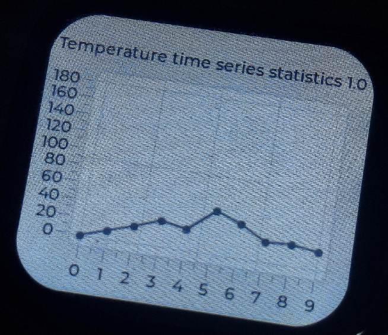
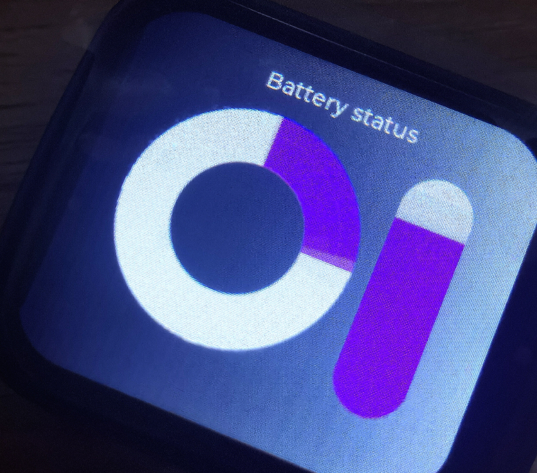
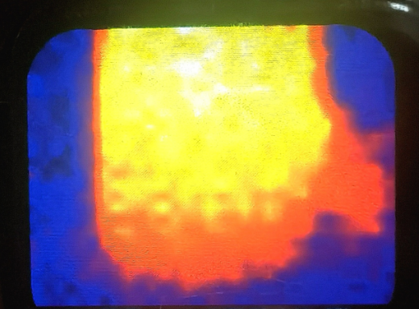
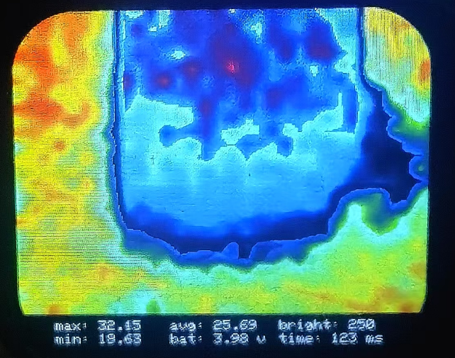
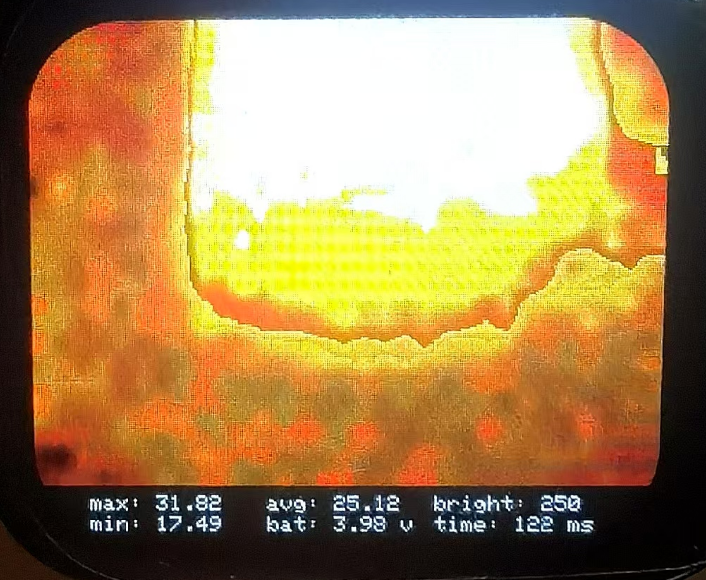
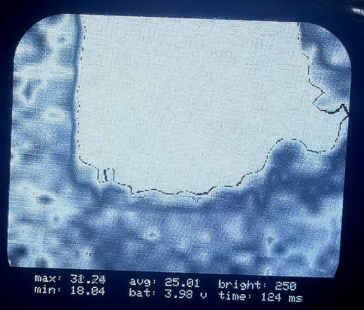
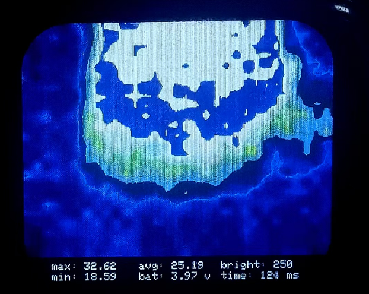
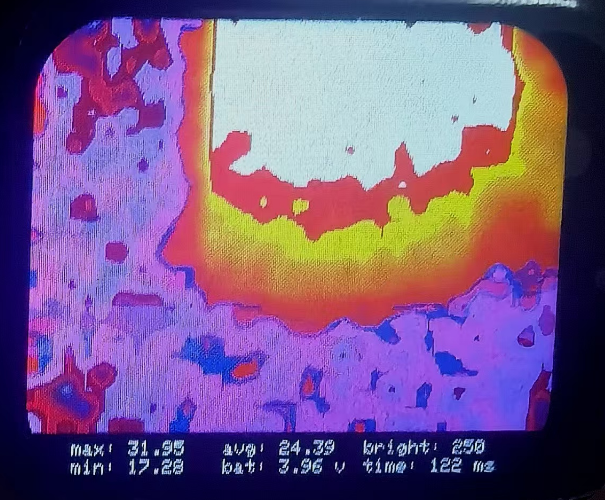
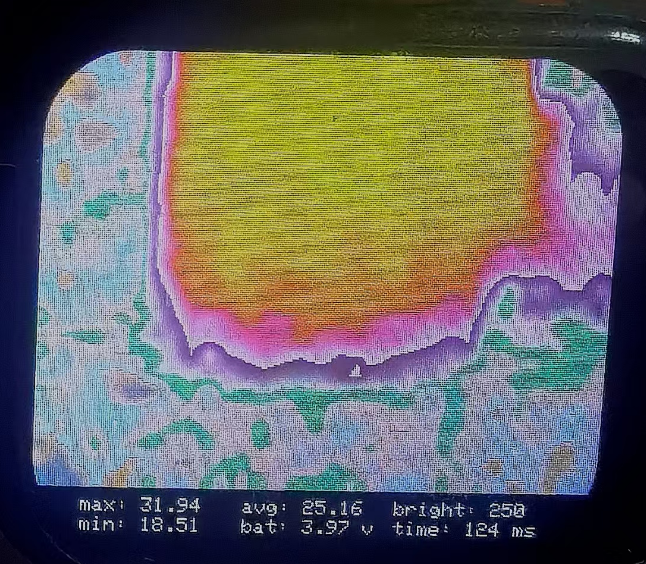

# Thermal_Imaging_Camera

This is a small thermal imaging camera that includes everything from hardware and software.

 

# 小尺寸热成像相机-Pico-LVGL-RTOS

基于RP2040 Pico主控与RTOS，榨干双核性能实现LVGL和成图任务并行。ST7789驱动240×280屏，CST816T触摸IC，MLX90640传感器实现热成像功能。充电采用SGM4056，DC-DC使用SGM6031等等。

先进行功能演示：（下述视频如果你的网咯不加可能得等等了~）

https://github.com/user-attachments/assets/03d069f4-99f0-401d-a997-cd3771a99602

[我设计了类似Apple Watch的小尺寸热成像相机！_哔哩哔哩_bilibili](https://www.bilibili.com/video/BV1f2cqeFEhV/?spm_id_from=333.999.0.0&vd_source=b92f0eff9ee9754b45582937ba74e8dd)

产品描述：树莓派RP204 Pico, 双核 LVGL RTOS，合理分配热成像呈现内容，UI画面的更新反馈。

探头既可支持长焦的BAB款，支持广角的BAA款，MCU + ST7789屏幕（240 * 280）+ CST816T 触摸IC + MLX90640热成像传感器 + 充电采用SGM4056，DC-DC使用SGM6031等等。

ui类似Apple Watch，按键1开启ui，支持卡尔曼滤波、插值切换、7种显示色彩和温度，折线图，电池电量。按键2拍照，触摸屏显示任意位置温度不限个数，支持调光。

**传统热成像设备的痛点**：

- **价格昂贵**：大多数热成像设备由于采用高端传感器和复杂的硬件设计，导致成本高昂。
- **体积较大**：便携性较差，限制了其在移动应用或小型设备中的应用。
- **开发门槛高**：传统设备通常依赖复杂的嵌入式系统，难以快速定制化开发。

**用户需求**：

- 对于消费者和开发者而言，市场需要一种低成本、小尺寸、易用的热成像解决方案，同时具备良好的图像质量和功能拓展性。

**产品优势**：

- **低成本实现**：
  - 通过使用 **RP2040 Pico** 和 **MLX90640** 这类性价比高的硬件组合，实现了功能的最大化。
  - 使用开源的 **LVGL** 图形库，避免高额商业软件授权费用。

- **小尺寸设计**：
  - 紧凑的硬件结构使设备便于携带和嵌入其他系统，例如无人机、手持设备等场景。

- **高性能多任务**：
  - 基于 **RTOS** 实现多任务调度，充分利用 RP2040 的双核性能，在图像处理和触摸交互中保持流畅性能。

- **高扩展性**：
  - 支持通过触摸屏实现用户交互（例如温度调节、热图切换）。
  - 支持电池供电，搭配 **SGM4056** 和 **SGM6031** 提供高效的电源管理。

项目包含下述内容

- 硬件部分、PCB制板、BOM表文件等等 (**Hardware**)
- 软件程序、用于RP2040软件程序以及LVGL UI等等(**Software**)
- 上位机（**Upper_computer**）
- 二次开发方案
- 技术支持、全项目内容答疑
- 项目持续更新中（**任何问题和想法 功能都可以跟我提，我会慢慢跟进解决**）

# 功能图例

下图为用户配置设置界面，你可以设置配置你想要的参数，例如是否插值，是否启用卡尔曼滤波，色彩选择等。

 

下图是温度折线图界面，左滑即可。

 

下图为电源状态管理界面，右滑即可。

 

下图为相机状态，也就是捕捉热源成像。

 

下述就是不同色彩呈现的图示了。

 

 

 

 

**更多的功能就不演示了，可以看上述链接视频~**
